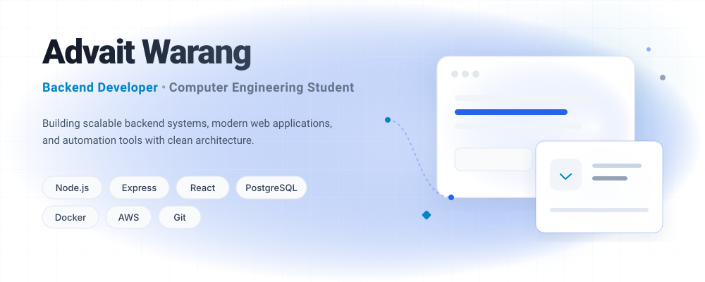

  <picture>
    <source media="(prefers-color-scheme: dark)" srcset="./assets/banner-dark.svg">
    <source media="(prefers-color-scheme: light)" srcset="./assets/banner-light.svg">
    
  </picture>

 

  
  
  
  
  

 

## 🚀 What I'm Building

<table width="100%" border="0" cellspacing="0" cellpadding="0">
  <tr>
    <td width="50%" valign="top">
      

        <h3>👨‍🎓 Internship Tracker</h3>
        
Role-based internship management platform with authentication and secure routing.

        

          
          
          
          
        

        
<a href="#"><b>GitHub</b></a> &nbsp;•&nbsp; <!-- <a href="#"><b>Live Demo</b></a> -->

      

    </td>
    <td width="50%" valign="top">
      

        <h3>🏫 DVD Classes ERP</h3>
        
Student management platform handling attendance, results, receipts, and role management.

        

          
          
          
        

        
<a href="#"><b>GitHub</b></a>

      

    </td>
  </tr>
  <tr>
    <td width="50%" valign="top">
      

        <h3>🛡️ Offer Shield AI</h3>
        
Resume and offer verification system utilizing OCR and data automation.

        

          
          
          
        

        
<a href="#"><b>GitHub</b></a>

      

    </td>
    <td width="50%" valign="top">
      

        <h3>📊 Analyzer OCR</h3>
        
OCR-powered data analysis dashboard for real-time insights.

        

          
          
          
        

        
<a href="#"><b>GitHub</b></a>

      

    </td>
  </tr>
  <tr>
    <td width="50%" valign="top">
      

        <h3>🚑 Emergency Healthcare System</h3>
        
Hackathon-winning project for rapid healthcare response coordination.

        

          
          
          
          
        

        
<a href="#"><b>GitHub</b></a>

      

    </td>
    <td width="50%" valign="top">
      

        <!-- Placeholder to maintain grid structure -->
      

    </td>
  </tr>
</table>

 

## ⚙️ Engineering Focus

<table width="100%">
  <tr>
    <td width="33%" align="center">
      <h3>🏛️ Backend Architecture</h3>
      
Building scalable and maintainable server-side logic.

    </td>
    <td width="33%" align="center">
      <h3>🔌 REST APIs</h3>
      
Designing robust interfaces for decoupled client communication.

    </td>
    <td width="33%" align="center">
      <h3>🔒 Authentication</h3>
      
Implementing secure JWT, OAuth, and RBAC strategies.

    </td>
  </tr>
  <tr>
    <td width="33%" align="center">
      <h3>🗄️ Database Design</h3>
      
Structuring relational and NoSQL databases for performance.

    </td>
    <td width="33%" align="center">
      <h3>🤖 Automation</h3>
      
Writing scripts and workflows to streamline development.

    </td>
    <td width="33%" align="center">
      <h3>📐 System Design</h3>
      
Planning distributed systems and microservices architectures.

    </td>
  </tr>
</table>

 

## 💻 Tech Stack

### Languages
`JavaScript` &nbsp;&middot;&nbsp; `Python` &nbsp;&middot;&nbsp; `SQL` &nbsp;&middot;&nbsp; `HTML` &nbsp;&middot;&nbsp; `CSS`

### Frontend
`React` &nbsp;&middot;&nbsp; `Vite` &nbsp;&middot;&nbsp; `Tailwind CSS`

### Backend
`Node.js` &nbsp;&middot;&nbsp; `Express.js` &nbsp;&middot;&nbsp; `FastAPI` &nbsp;&middot;&nbsp; `REST APIs` &nbsp;&middot;&nbsp; `JWT Authentication`

### Databases
`PostgreSQL` &nbsp;&middot;&nbsp; `MongoDB` &nbsp;&middot;&nbsp; `MySQL`

### Cloud & Infrastructure
`Docker` &nbsp;&middot;&nbsp; `Linux` &nbsp;&middot;&nbsp; `AWS (Learning)` &nbsp;&middot;&nbsp; `GitHub Actions` &nbsp;&middot;&nbsp; `Nginx` &nbsp;&middot;&nbsp; `PM2`

### Tools
`Git` &nbsp;&middot;&nbsp; `GitHub` &nbsp;&middot;&nbsp; `VS Code` &nbsp;&middot;&nbsp; `Postman` &nbsp;&middot;&nbsp; `Figma` &nbsp;&middot;&nbsp; `Cloudinary` &nbsp;&middot;&nbsp; `Render` &nbsp;&middot;&nbsp; `Vercel` &nbsp;&middot;&nbsp; `Netlify`

 

## 🚧 Currently Building
`Internship Tracker` &nbsp;&middot;&nbsp; `Docker` &nbsp;&middot;&nbsp; `AWS` &nbsp;&middot;&nbsp; `DevOps` &nbsp;&middot;&nbsp; `Microservices` &nbsp;&middot;&nbsp; `System Design`

 

## 📈 GitHub Activity

  <picture>
    <source media="(prefers-color-scheme: dark)" srcset="https://github-readme-stats.vercel.app/api?username=Advait-3000&show_icons=true&theme=tokyonight&hide_border=true&bg_color=050816&title_color=2563EB">
    <source media="(prefers-color-scheme: light)" srcset="https://github-readme-stats.vercel.app/api?username=Advait-3000&show_icons=true&theme=default&hide_border=true&bg_color=FFFFFF&title_color=2563EB">
    
  </picture>

 

  <picture>
    <source media="(prefers-color-scheme: dark)" srcset="https://github-readme-streak-stats.herokuapp.com/?user=Advait-3000&theme=tokyonight&hide_border=true&background=050816&ring=2563EB&fire=38BDF8&currStreakLabel=60A5FA">
    <source media="(prefers-color-scheme: light)" srcset="https://github-readme-streak-stats.herokuapp.com/?user=Advait-3000&theme=default&hide_border=true&background=FFFFFF&ring=2563EB&fire=0284C7&currStreakLabel=2563EB">
    
  </picture>

 

  <picture>
    <source media="(prefers-color-scheme: dark)" srcset="https://github-readme-stats.vercel.app/api/top-langs/?username=Advait-3000&layout=compact&theme=tokyonight&hide_border=true&bg_color=050816&title_color=2563EB">
    <source media="(prefers-color-scheme: light)" srcset="https://github-readme-stats.vercel.app/api/top-langs/?username=Advait-3000&layout=compact&theme=default&hide_border=true&bg_color=FFFFFF&title_color=2563EB">
    
  </picture>

 

  <picture>
    <source media="(prefers-color-scheme: dark)" srcset="https://raw.githubusercontent.com/Advait-3000/Advait-3000/output/github-contribution-grid-snake-dark.svg">
    <source media="(prefers-color-scheme: light)" srcset="https://raw.githubusercontent.com/Advait-3000/Advait-3000/output/github-contribution-grid-snake.svg">
    
  </picture>

